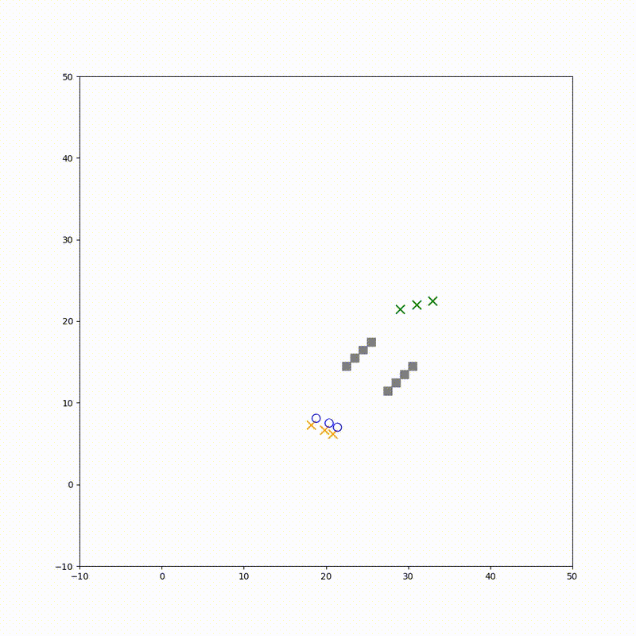

# Autonomous Robot Attacks

## Table of Contents
- [Overview](#overview)
- [Attack Types](#attack-types)
  - [ORCA Attacks](#orca-attacks)
  - [GLAS Attacks](#glas-attacks)
- [Video Demonstrations](#video-demonstrations)
  - [ORCA Environments](#orca-environments)
  - [GLAS Environments](#glas-environments)
- [Documentation](#documentation)
- [License](#license)

## Overview

This repository contains implementations of various attacks on autonomous robot navigation systems, specifically targeting ORCA and GLAS algorithms. The attacks demonstrate different ways to manipulate robot behavior, from causing collisions to controlling movement patterns.

## Attack Types

### ORCA Attacks
<details>
<summary>Click to expand ORCA attack details</summary>

The following attacks are implemented for the ORCA navigation algorithm:

1. **Deadlock Attack**
   - Purpose: Immobilizes the victim robot
   - Implementation: [View Details](./Attacks/orca/README.md#deadlock-attack)

2. **Herding Attack**
   - Purpose: Forces the victim robot to move to an attacker-defined zone
   - Implementation: [View Details](./Attacks/orca/README.md#herding-attack)

3. **Navigation Delay Attack**
   - Purpose: Doubles the navigation time of the victim robot
   - Implementation: [View Details](./Attacks/orca/README.md#navigation-delay-attack)

4. **Robot-to-Robot Collision (R2R)**
   - Purpose: Causes collisions between robots
   - Implementation: [View Details](./Attacks/orca/README.md#r2r-attack)

5. **Robot-to-Obstacle Collision (R2O)**
   - Purpose: Causes robot collisions with obstacles
   - Implementation: [View Details](./Attacks/orca/README.md#r2o-attack)
</details>

### GLAS Attacks
<details>
<summary>Click to expand GLAS attack details</summary>

Similar attacks are implemented for the GLAS navigation algorithm. See [GLAS documentation](./Attacks/glas/README.md) for specific implementation details.
</details>

## Video Demonstrations

### Attacks on ORCA

#### Environment 1

##### Deadlock Attack
<table>
  <tr>
    <th>Benign Behavior</th>
    <th>Under Attack</th>
  </tr>
  <tr>
    <td>
      
    </td>
    <td>
      
    </td>
  </tr>
</table>

##### Herding Attack
<table>
  <tr>
    <th>Benign Behavior</th>
    <th>Under Attack</th>
  </tr>
  <tr>
    <td>
      
    </td>
    <td>
      
    </td>
  </tr>
</table>

##### Navigation Delay Attack
<table>
  <tr>
    <th>Benign Behavior</th>
    <th>Under Attack</th>
  </tr>
  <tr>
    <td>
      
    </td>
    <td>
      
    </td>
  </tr>
</table>

##### Robot-to-Obstacle Attack
<table>
  <tr>
    <th>Benign Behavior</th>
    <th>Under Attack</th>
  </tr>
  <tr>
    <td>
      
    </td>
    <td>
      
    </td>
  </tr>
</table>

##### Robot-to-Robot Attack
<table>
  <tr>
    <th>Benign Behavior</th>
    <th>Under Attack</th>
  </tr>
  <tr>
    <td>
      
    </td>
    <td>
      
    </td>
  </tr>
</table>

#### Environment 2-1

##### Deadlock Attack
<table>
  <tr>
    <th>Benign Behavior</th>
    <th>Under Attack</th>
  </tr>
  <tr>
    <td>
      
    </td>
    <td>
      
    </td>
  </tr>
</table>

##### Herding Attack
<table>
  <tr>
    <th>Benign Behavior</th>
    <th>Under Attack</th>
  </tr>
  <tr>
    <td>
      
    </td>
    <td>
      
    </td>
  </tr>
</table>

##### Navigation Delay Attack
<table>
  <tr>
    <th>Benign Behavior</th>
    <th>Under Attack</th>
  </tr>
  <tr>
    <td>
      
    </td>
    <td>
      
    </td>
  </tr>
</table>

##### Robot-to-Obstacle Attack
<table>
  <tr>
    <th>Benign Behavior</th>
    <th>Under Attack</th>
  </tr>
  <tr>
    <td>
      
    </td>
    <td>
      
    </td>
  </tr>
</table>

##### Robot-to-Robot Attack
<table>
  <tr>
    <th>Benign Behavior</th>
    <th>Under Attack</th>
  </tr>
  <tr>
    <td>
      
    </td>
    <td>
      
    </td>
  </tr>
</table>

#### Environment 3-2

##### Robot-to-Robot Attack
<table>
  <tr>
    <th>Benign Behavior</th>
    <th>Under Attack</th>
  </tr>
  <tr>
    <td>
      
    </td>
    <td>
      
    </td>
  </tr>
</table>

### Attacks on GLAS

#### Environment 1

##### Deadlock Attack
<table>
  <tr>
    <th>Benign Behavior</th>
    <th>Under Attack</th>
  </tr>
  <tr>
    <td>
      
    </td>
    <td>
      
    </td>
  </tr>
</table>

##### Herding Attack
<table>
  <tr>
    <th>Benign Behavior</th>
    <th>Under Attack</th>
  </tr>
  <tr>
    <td>
      
    </td>
    <td>
      
    </td>
  </tr>
</table>

##### Navigation Delay Attack
<table>
  <tr>
    <th>Benign Behavior</th>
    <th>Under Attack</th>
  </tr>
  <tr>
    <td>
      
    </td>
    <td>
      
    </td>
  </tr>
</table>

#### Environment 2-1

##### Deadlock Attack
<table>
  <tr>
    <th>Benign Behavior</th>
    <th>Under Attack</th>
  </tr>
  <tr>
    <td>
      
    </td>
    <td>
      
    </td>
  </tr>
</table>

##### Herding Attack
<table>
  <tr>
    <th>Benign Behavior</th>
    <th>Under Attack</th>
  </tr>
  <tr>
    <td>
      
    </td>
    <td>
      
    </td>
  </tr>
</table>

##### Navigation Delay Attack
<table>
  <tr>
    <th>Benign Behavior</th>
    <th>Under Attack</th>
  </tr>
  <tr>
    <td>
      
    </td>
    <td>
      
    </td>
  </tr>
</table>

##### Robot-to-Obstacle Attack
<table>
  <tr>
    <th>Benign Behavior</th>
    <th>Under Attack</th>
  </tr>
  <tr>
    <td>
      
    </td>
    <td>
      
    </td>
  </tr>
</table>

##### Robot-to-Robot Attack
<table>
  <tr>
    <th>Benign Behavior</th>
    <th>Under Attack</th>
  </tr>
  <tr>
    <td>
      
    </td>
    <td>
      
    </td>
  </tr>
</table>

#### Environment 3-2

##### Robot-to-Obstacle Attack
<table>
  <tr>
    <th>Benign Behavior</th>
    <th>Under Attack</th>
  </tr>
  <tr>
    <td>
      
    </td>
    <td>
      
    </td>
  </tr>
</table>

#### Environment 3-3

##### Robot-to-Robot Attack
<table>
  <tr>
    <th>Benign Behavior</th>
    <th>Under Attack</th>
  </tr>
  <tr>
    <td>
      
    </td>
    <td>
      
    </td>
  </tr>
</table>

##### Robot-to-Obstacle Attack
<table>
  <tr>
    <th>Benign Behavior</th>
    <th>Under Attack</th>
  </tr>
  <tr>
    <td>
      
    </td>
    <td>
      
    </td>
  </tr>
</table>

## Documentation

For detailed documentation of each attack type, please refer to their respective README files:
- [ORCA Attacks Documentation](./Attacks/orca/README.md)
- [GLAS Attacks Documentation](./Attacks/glas/README.md)

Each environment features different obstacle configurations to demonstrate attack effectiveness across various scenarios.

## Project Structure
```
.
├── Attacks/
│   ├── orca/
│   │   └── README.md
│   └── glas/
│       └── README.md
├── Videos/
│   ├── orca/
│   │   ├── orca-env1-files/
│   │   ├── orca-env2-1-files/
│   │   ├── orca-env3-2-files/
│   │   └── orca-env3-3-files/
│   └── glas/
│       ├── glas-env1-files/
│       ├── glas-env2-1-files/
│       ├── glas-env3-2-files/
│       └── glas-env3-3-files/
├── LICENSE
└── README.md
```

## License

This project is licensed under the MIT License - see the [LICENSE](LICENSE) file for details.

Test